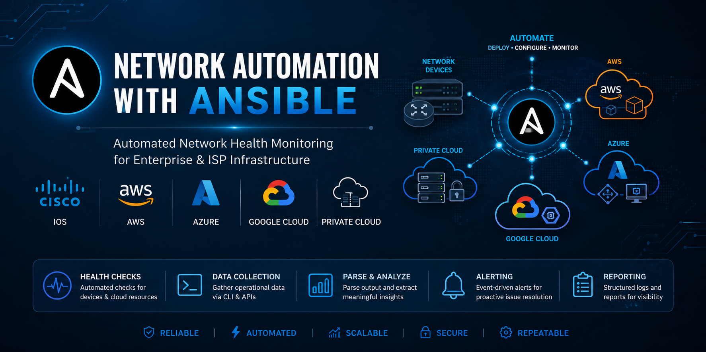

# Network Automation with Ansible

<p align="center">
  
</p>

<p align="center">
  <strong>Automated Network Health Monitoring for Enterprise & ISP Infrastructure</strong>
</p>

<p align="center">


</p>
---

## Overview
Ansible-based automation framework for performing automated health checks on routers and switches across enterprise and ISP network environments.

This project gathers operational data, parses device output, and helps proactively identify network issues before they impact service availability or stability.

---

## Key Features

- Automated health checks for Cisco routers and switches
- Hybrid infrastructure monitoring
- Multi-cloud observability (AWS, Azure, GCP, OCI, Private Cloud)
- Connectivity validation and health reporting
- Threshold-based alerting
- Structured operational data collection
- Role-based Ansible architecture
- Extensible for enterprise and ISP environments

---

## Architecture
- Ansible Playbooks for orchestration
- Ansible Roles for reusable automation logic
- Cisco IOS modules for network data collection
- Structured YAML-based configuration

---

## Project Structure
```
network-automation-ansible/
│
├── .github/
│   └── workflows/
│       └── ansible-health-check.yml # GitHub Actions CI monitoring workflow
├── health_check.yml                 # Main orchestrator playbook (hybrid monitoring)
├── ansible.cfg                      # Ansible configuration
├── README.md                        # Project documentation
├── LICENSE                          # MIT License
├── .gitattributes                   # GitHub language detection
├── .gitignore                       # Ignore logs, vault password, temporary files
├── .vault/
│   └── vault_pass.txt               # Ansible Vault password (gitignored)
├── assets/
│   └── ansible-banner.png           # README banner
├── inventory/
│   └── hosts.ini                    # Infrastructure inventory (hosts & groups)
├── group_vars/
│   ├── all.yml                      # Global monitoring policy
│   ├── network.yml                  # Cisco IOS connection settings
│   ├── aws_cloud.yml                # AWS monitoring configuration
│   ├── azure_cloud.yml              # Azure monitoring configuration
│   ├── gcp_cloud.yml                # Google Cloud monitoring configuration
│   ├── oci_cloud.yml                # Oracle Cloud monitoring configuration
│   └── private_cloud.yml            # Private cloud monitoring configuration
├── host_vars/
│   └── devices.yml                  # Device and cloud instance metadata
├── roles/
│   └── health_checks/
│       ├── tasks/
│       │   ├── main.yml             # Hybrid monitoring and alerting logic
│       │   └── send_monitoring_alert.yml # Sends real-time monitoring alerts
│       ├── defaults/
│       │   └── main.yml             # Default monitoring thresholds
│       ├── vars/
│       │   └── main.yml             # Role-specific variables
│       └── handlers/
│           └── main.yml             # Event-driven alert handlers
├── scripts/
│   └── send_mon_summary.py          # Sends monitoring execution summary
├── templates/                       # Future report and notification templates
└── logs/                            # Runtime execution logs
    ├── .gitkeep
    └── .gitignore
```

---

## Example Use Case

Automated health check workflow:

1. Connect to network devices via Ansible  
2. Collect operational state using IOS facts modules  
3. Extract key device information:
   - Hostname
   - OS version
   - Hardware model
   - Serial number  
4. Display structured output for validation and monitoring  

---

## Sample Output

Router: R1-EDGE-01
OS Version: IOS-XE 17.x
Model: Cisco ISR 4451-X
Serial Number: FGL2345ABC

---

## Technologies Used
- Ansible
- YAML
- Cisco IOS Automation Modules
- Network Engineering (L2/L3)
- Infrastructure Automation

---

## Security

This project follows infrastructure automation security best practices by supporting **Ansible Vault** for protecting sensitive credentials.

### Protected Configuration
- Cisco device credentials
- Enable passwords
- API tokens
- Cloud authentication secrets

Sensitive variables can be encrypted using Ansible Vault before deployment:

```bash
ansible-vault encrypt group_vars/network.yml
```
---

## Use Cases
- Network health monitoring
- Pre-incident detection
- ISP and enterprise network automation
- Configuration validation workflows
- Operational visibility improvement

---

## Future Enhancements
- Integration with SIEM for alerts
- Export results to Prometheus / Grafana
- Multi-vendor support (Juniper, Arista, Fortinet)
- Slack / Email alerting system
- CI/CD pipeline integration for network automation

---

## Author
**Joyce Mwangi**  
Network & Cloud Infrastructure Engineer  
GitHub: https://github.com/joycemwangi  
LinkedIn: https://linkedin.com/in/wanjajoyce


